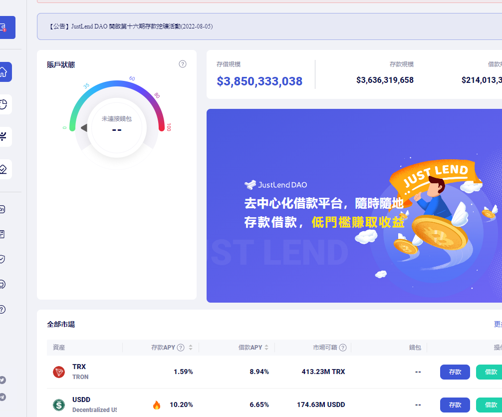

## JustLend

### 1.JustLend 是什么

justlend 是Tron 波场链上的一个借贷协议，这本借贷协议，基本上完全抄袭的Compound 的代码，在公开的仓库中，合约的名字也没有变化, 和Compound 开源代码保持一致的。

其实有一点想不通的是，孙宇晨这是在完全抄袭的代码，怎么能够做到在Defilama 上面保持了这么高的TVL 的，而且这个项目的前端做的很土，上面的Token 也除了USDT,USDC,BTC 和ETH 这些，其他的完全是从来没玩过，看起来像土狗，感觉像土狗的，Tron链上其他代币。

### 2.如何使用此协议

整个使用是体验就像Compound ，当连接了自己的TronLink插件钱包之后，首页面展示每个市场的存款与借款的规模与市场收益率的数据。

点击存款/ 借款, 就可以根据自己当前的利率模型(抵押因子)，完整借贷的操作。

### 3.DAO 治理

JustLend 的治理模型也是完全抄袭Compound 源码的，平台通过发行的JST 代币，参与提案的治理。而且从项目之前的提案也治理结果来看，主要的一些提案很简单，添加新的借贷市场，调整某个市场中的利率模型，调整下参数，其他的，呃, 没了。

而且JST的最大仓位应该也在孙宇晨那里，所以，整体上这个项目，是没有任何创新点的。

