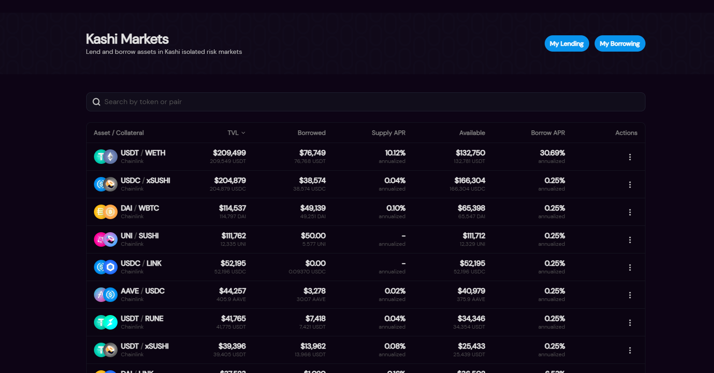
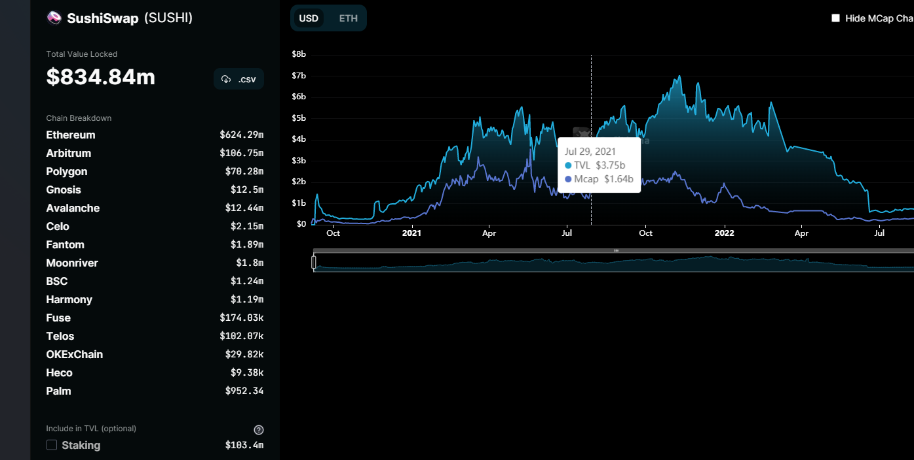

## SushiSwap

### 1. Sushi协议的诞生

"[sushi](https://en.wikipedia.org/wiki/Sushi)"来自日本，本意是"寿司"的意思。Sushi的源代码几乎是完全借鉴Uni-V2 的代码，同样使用AMM模型来做市。SushiSwap在uniswap 发现uni Token 之前，提前发行了Sushi 代币，同时在UniSwap 上提供交易对的用户，可以将他们的Lp token 放到Sushi 上面来进行聚合收益，获得Sushi token 。同时这一行为也别成为"吸血鬼攻击"，将Uniswap 上面的大量的流动性，直接迁移到了SushiSwap上面来。

### 2. Shshi当前的功能

* Swap , Add LP

  这些就是AMM 机制的标准组成部分了。

* Limit Order

​		限价单使用[bentoBox](https://docs.sushi.com/docs/Products/Bentobox)(便当盒)来作为限价单的池子。当限价单被创建之后，这个单子就会被上传到AWS的服务器进行存储。服务器与池子的交易对保持webSocket 的长连接。当价格达到限价的时候，这份挂单就会被自动吃掉。

* Onsen Menu 温泉菜单

  在Farm 页面，有一份温泉菜单，这里放了一些APr 和sushi 回报率很高的一些交易对，通过为这些交易对做Lp， 或者在此页面进行单币质押，也能拿到这种很高的收益率。(交易对通常有一个相对稳定的币,WETH, USDC)和一个相对冷门的币种组成。 这些冷门的小币种，是也是存在一定的风险的。

* Kashi Markets 

  Sushi 也创建了自己的借贷市场- Kashi， 不像Compoud和Aave那种，多个市场间的是共通的，当某个市场发生风险，其他市场也会发生连带的风险，而在Sushi 上面的借贷只是针对某个市场内部的风险，交易对与交易对直接都是隔离开的。发生风险，之后影响此交易对，其他的没有连带的风险。

* Miso ->  LaunchPad 

一些项目一级市场的宣发，可以通过发射台的方式来进行初始Token 募集。项目代币正式宣发之后，便可以很方便的在Sushi 上面建造交易池。

### 3. 产品特点

* 多链部署

​	Sushi 目前部署在很多条EVM 兼容的链上。所以在这些链上，都可以建造池子，为每条链上的Token提供链上交易的流动性。

* Sushi 质押挖矿

  每次Swap 的0.005%的收益，都会被分给对池中进行Sushi 质押的用户，将sushi 放在 shshi bar 中进行质押，可以收获到xShshi 的收益。目前收益率在 16.09%左右。也是挺稳定的收益率。当点击取消质押的时候，便可以将自己的xSushi 收益和shshi 同时取出来。

* 收益聚合器

  将sushi 质押在bentoBox上，之后获得的xSushi 收益可以被自动复投。其中有两种方式，第一种直接放在bentobox上，第二种是将收益得到的xSushi 放到Aave A池中进行质押，获得axShshi质押的收益。