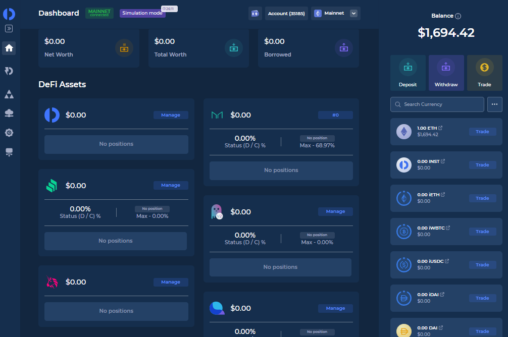

### Instadapp 

#### 1. InstaDapp 的起源

InstaDapp 的创始人，是两个[印度小伙子](https://twitter.com/sowmay_jain)，在他们辍学前，哥哥做金融，财经方面的研究，弟弟做计算机方面的研究，18年，两兄弟参加ETH India的黑客松，创造了makerScan的工具。之后获得了一笔投资，便开始了InstaDapp 项目的发展

想来我在20,21岁的时候，因为疫情，整日居家，没有外出，当时对于Dapp 开发没有多少了解，对于程序的运行了解的也不多。虽然课业不重，比较轻松，但是还是没有向他们一样，直接用做项目，参与开发。

#### 2. 服务提供商

InstaDapp 的首页，显示的是: 构建Defi的基建。为Defi 构建更先进的杠杆平台。

进入到首页，连接上钱包，便会提示自己，创建一个属于自己的DSA 账户，创建一个账号即是部署一本代理合约(代理合约的实现是一本同样的实现合约中的逻辑)。InstaDapp 也提出了另外的概念 DSL( DeFi Smart Layer ) 

### 3. 使用服务

InstaDapp提供了Simulation Mode (模拟模式), 在模拟账号中会给自己生成100个ETH，

通过deposit() 便可以将自己钱包中的资产放到自己DSA账号中。此时钱包中的代币便可以进行交易。

InstaDapp 聚合了MakerDao, Compound, Aave, Liquidity 池中的数据

通过`Import Position ` 便可以

