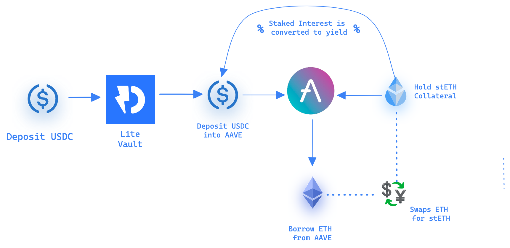

### Instadapp 

#### 1. InstaDapp 的起源

InstaDapp 的创始人，是两个[印度小伙子](https://twitter.com/sowmay_jain)，在他们辍学前，哥哥做金融，财经方面的研究，弟弟做计算机方面的研究，18年，两兄弟参加ETH India的黑客松，创造了makerScan的工具。之后获得了一笔投资，便开始了InstaDapp 项目的开发。

想来我在20,21岁的时候，因为疫情，整日居家，没有外出，当时对于Dapp 开发没有多少了解，对于程序的运行了解的也不多。虽然课业不重，比较轻松，但是还是没有像他们一样，直接用做项目，参与开发。

#### 2. 服务提供商

InstaDapp 的首页，显示的是: 构建Defi的基建。为Defi 构建更先进的杠杆平台。

进入到首页，连接上钱包，便会提示自己，创建一个属于自己的DSA 账户，创建一个账号即是部署一本代理合约(代理合约的实现是一本所有用户一样的实现合约中的逻辑)。InstaDapp 也提出了另外的概念 DSL( DeFi Smart Layer ) 。

DSL 主要由三部分组成, 账号，各种连接器(与Defi 协议进行交互)，权限管理模块

#### 3.使用服务

InstaDapp提供了Simulation Mode (模拟模式), 在模拟账号中会给自己生成100个ETH，

通过deposit() 便可以将自己钱包中的资产放到自己DSA账号中。此时钱包中的代币便可以进行交易。这个时候就可以很方便的与各个协议进行Swap, 提供流动性，Yiled Farming  等等。

InstaDapp 聚合了MakerDao, Compound, Aave, Liquidity 池中的数据和流动性。

#### 4.[聚合页面](https://assembly.instadapp.io/)

通过聚合页面，这里列出了一些常用的defi 协议。

点进去某个协议，便可以看到自己的账号在某个协议上的具体行为。在AAVE 和Compound 上面可以看到自己抵押借贷的Position。在MakerDao上可以看到自己存放ETH ，生成的DAI 的详情。在这里的1inch 也可以快速的聚合其他的swap数据，从而选择最优的交易进行执行。

#### 5.使用其他协议

使用Inst Pools,可以将手中指定的$Inst 和ETH 放到 UniV3上面做LP,获得LP的激励。

也可以很方便的将使用makerDAO，借出DAI 稳定币。

在Compund 使用借贷协议，提高手中资产的流动性。

InstaDapp 提供了[Refinanfce](https://guides.instadapp.io/features/refinancing-between-protocols)的功能，当前支持了Compound ,Maker,和Aave 之间的债务/ 资产进行迁移。最常用的还是直接set Max ，迁移整个位置。

#### 6.Lite 模式

InstaDapp 也做了一站式聚合收益的产品-- -Lite模式。目前支持了ETH, USDC, WBTC和DAI 这些Token。通过减少交易笔数(交易手续费)来进行一站式操作。

目前的交易策略具体如下

* 存入ETH，将ETH 放到lido 上面进行ETH的节点质押，获得到1:1对应的stETH，stETH也可以在aave协议中存入，获取借贷的收益。
* USDC, 将USDC 存入aave 协议中，借出一定量的ETH 之后将ETH存入到Lido中进行质押，从而进行获取节点收益。
* iToken， 资产存入InstaDapp 中的凭证是iToken, iToken 的数量，即用户在协议中存入数量的比例。
* 取回自己资产的时候，InstaDapp 会在收益的所有中取出10%来作为协议方面的收入。

#### 7.一键循环贷

比如我当前只有100ETH,根据ETH的抵押率，我当前可以借出来80ETH，此时再将这80ETH进行抵押，借出64ETH，如此往复，完成Defi 之间的套娃。获得更高的收益率。

目前InstaDapp 聚合了这些操作，只需要一笔交易，我最多可以将100个ETH的价值，发挥到600ETH的作用，同时这样相当于对自己的资产上面加上了杠杆，风险同样也是成倍的增加。
