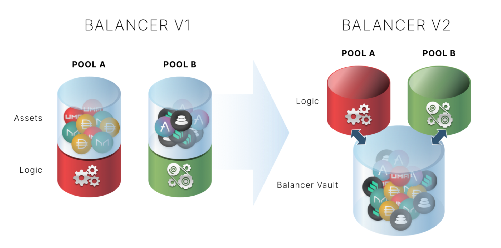
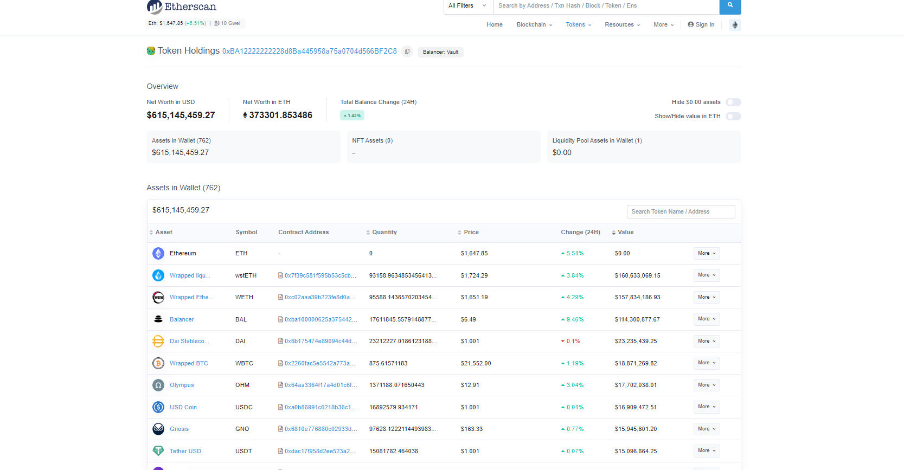

### Balancer Finance


### 1. Balancer 是什么

打开Balancer Finance 的首页，Balancer 对于自己的宣传是： 一个自动资产管理和交易的平台。首先，可以在balancer的池子中做LP ，相当于一种指数基金，由Balancer 为你配置，从而获得一份交易手续费和BAL Token 的收益。对于池子来说，balancer 允许自己设定不同资产的比例来创建新池。




### 2.多资产部署

不像标准AMM池中的逻辑，一个交易对只支持两个Token之间的swap, Balancer 允许在一个池中建立多个最多8种资产。

不同池的类型：

* [加权池](https://docs.balancer.fi/products/balancer-pools/weighted-pools) Weighted Pool

​		权重池允许用户以不同的比例来建造池子，比如80/20，当加权的比例越高的时候，这个池子会发生的无偿损失就会越低。

​	当外部价格发生变化，套利者便会通过交易来重新平衡池子的比例，LP 在提供流动性的同时，还可以获得交易的手续费。

> [BAL - ETH Pair ](https://app.balancer.fi/#/pool/0x5c6ee304399dbdb9c8ef030ab642b10820db8f56000200000000000000000014)  维持交易对中80%的BAL 和20%的ETH。


* 稳定池

  使用稳定币  (DAI/USDC/USDT ), 或者锚定资产(WBTC/renBTC/sBTC)来进行swap,

​	有点像Curve的公式，A代表着放大系数

```
  // invariant                                                                                 //
  // D = invariant                                                  D^(n+1)                    //
  // A = amplification coefficient      A  n^n S + D = A D n^n + -----------                   //
  // S = sum of balances                                             n^n P                     //
  // P = product of balances                                                                   //
  // n = number of tokens                                                                      //
```


* MetaStable Pool 元稳定池

  有点类似于稳定池，元稳定池有一对有交换率的两种资产来进行组合，比如Token于 cToken / ETH/ stETH 之间的交换。


* 流动性加强池( (LBPs))

​		LB Pools 可以动态改变资金的比例，比如新项目方来上新币，在Uni 这种DEX上，需要50%的其他币种(ETH / DAI)来建造池子，在Balancer 上便可使用80/20 (TokenAmt / DAI Amt)来启动初始资金。随着项目代币的价值越来越高，池中Token 的比例也会逐渐的升高。

* 收益增强池(AAVE)

  ​	Balancer Boosted Aave USD Pool (bb-a-USD) 

  将USDC / DAI  进行swap 可以兑换成指定的 bb-a-USDC /  bb-a-DAI 。这些代币会在;Aave 上提供流动性，从而获得收益的提升。


---


### 3.指数基金


根据[WikiPedia的定义](https://zh.m.wikipedia.org/zh/%E6%8C%87%E6%95%B0%E5%9F%BA%E9%87%91)，将一些符合条件的证券，通过一些指定的标准来进行选择，这些证券共同构成了一个指数，建立一个与指数完全相同或基本相同的投资组合。

同样,Balancer 做的也是这样的事情，打包多种资产，放在一个池中，做这个池的LP，就相当于够买这一系列标的的一个指数。




Balancer的池子构造与其他dex有些不同，在其他DEX的交易对逻辑中，多次交易(A -> B -> C )非常费钱，需要在合约直接进行Token的transfer。balancer的策略是在一本合约中存储这些资产。同样这也降低了Balancer上面的滑点(流动性深)，节省了大量的交易手续费。


### 4.SOR 合约路由

Smart Order Router 会为balancer 上的trader 寻找最合适的价格。

首先路由会根据这笔订单的(Input, OutPut)生成一个列表，之后根据订单的大小来为所以可行的方案来进行匹配(滑点最小,gas 使用小)。


### 5.BAL Token

Bal 作为balancer 协议的治理代币，0xb618F903ad1d00d6F7b92f5b0954DcdC056fC533。平台通过SnapShot 来对提案进行投票，参与提案的治理。

同样, veBAL 作为用户将BAL 进行锁仓，获得的投票权，池与池直接需要经过Gauge来决定各个分配BAL的比例与数量。


### 6. BUIDL;

Balancer 的合约开源，开发者可以很容易的创建新的池，发布新的Token。对外也提供的完整的API（使用Subgraph)进行索引，价格通过TWAP算法来计算，从而维护Oracle上面的稳定性。
