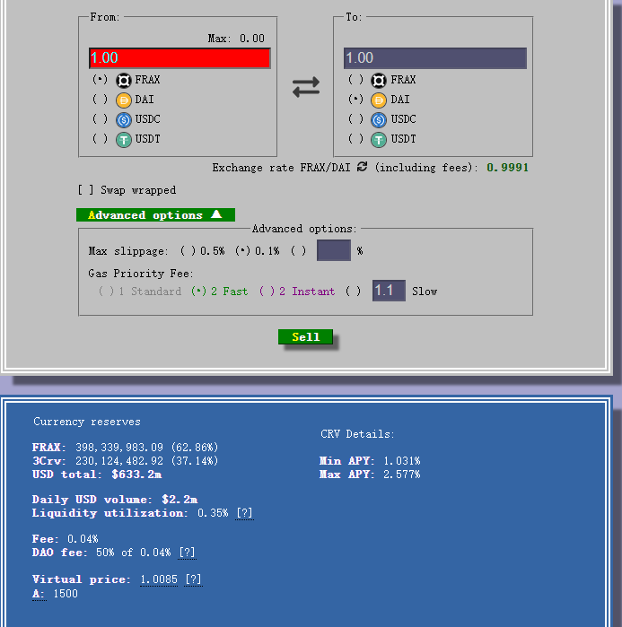

## Frax Finance

### 1. 算稳No.1

自从Terra链上的UST 和Luna 发生死亡螺旋之后，Frax 便成为了如今算法稳定币的龙头。算法稳定币是根据一套算法，来动态调整稳定币mint(铸造)出来的数量。当前Frax的生成便是靠着USDC和平台代币FXS两部分来进行合成，当FRAX 价格进行波动，场外便有了对于FRAX稳定币的套利区间，通过这种价格的锚定，最后使得稳定币FRAX稳定在1美元 。

FXS Sharas[FXS] 是FRAX 平台发行的治理代币，总的发行量为1亿枚。绝大部分的FRX代币是通过流动性挖矿进行获得的，在Uniswap 上为这三种交易对 [FRAX-USDC 33% FRAX-FXS 33% FRAX-ETH 33%]提供流动性，便可以获得Lp token， 将LP Token 在FRAX finance 平台进行质押，便会持续的挖到FXS 代币。

### 2. 锚定机制与AMO

当前USDC 占协议抵押比例的92.5%，这个抵押率还是相当的高的，说明FRAX 还是相对很稳定的，不容易发生Unpeg。

为了使FRAX 锚定在$1，当FRAX < $1的时候。拿到1枚FRAX 可以来赎回价值1美元的USDC和FXS，之后就FRX卖出，完成套利，此时抵押比例(**CR**）会升高。当FRAX> $1的时候，套利者将通过USDC和FXS去创建FRAX，并卖出FRAX而获利，此时抵押比例会降低。

在FRAX V2 中便使用AMO(Algorithmic Market Operations Controller)这套机制来自动套利，从而自己来实现FRAX的价格锚定。 FRAX 也会监控在Curve上面的FRAX 交易对，如果发生池子不平衡的状态，便会自动的将池子填补，完成价格锚定。

### 3. FPI

FPI 是一种锚定CPI的一种稳定币。随着CPI(消费者生产指数)的不断增长，1美元所能购买的东西是在下降的。当CPI 增长8%， 比如通过10000个FRAX稳定币获得同样的10000个FPI， 在CPI公布后， 我这10000枚FPI 能够兑换到10800个对应的FRAX 稳定币。

#### 4. Curve上面的Frax 池 -AMO

Curve AMO 主要做了两件事情，如果Curve & 3CRV 组成的池子不平衡：

* 比例偏向于Frax(Frax 的比例小于50%)，此时AMO 机制增发FRAX， 进入到Curve 池中来做平衡。
* 比例大于50%的情况，回撤FRAX ，并且燃烧掉，换购成USDC 从而来重新平衡池子。

另外一个比较重要的点是： 最近Frax 升级后的策略是：Frax 被铸造的时候，其抵押品并不一定只是进行抵押不动，USDC 可以放在Aave, Yearn ,Compound 上面进行收益。同样，在安全的策略下， 更多的Frax 可以被安全的铸造出来，一些新的frax 可以用来回购FXS, 之后销毁掉一半的FXS， 另外一部分FXS 进行对ve FXS 的激励。

#### 5. [Frax Lend ](https://dune.com/blockworks_research/fraxlend)

Frax 提供一个超额抵押的平台，目前支持[WETH, WBTC, CVX, FXS, CRV]，这些代币，从而借出FRAX稳定币。最大的借出比例可以达到75%。并且每个交易对的风险是隔离的。这个协议将FRAX deposit 进去，从而供用户有效的借出FRAX。

FraxLend通过借贷的方式增加了用户对Frax的需求量，同时也对协议产生了更多的回报。当Frax的需求上涨的时候，背后支撑的FXS 代币的价格也在上涨。

#### 6. fxsETH

Frax 团队已经对稳定币的管理有非常多的经验了。所以想发行币本位锚定ETH 的frxETH 代币【weth】 和质押的sFrxETH(相当于steth)，质押frxETH ，可以进行生息。

直接将ETH 转化为frxETH 不会产生收益，FrxETH可以进行质押，从而获得验证节点的收益。sfrxETH 是一个ERC-4626 标准的协议。
