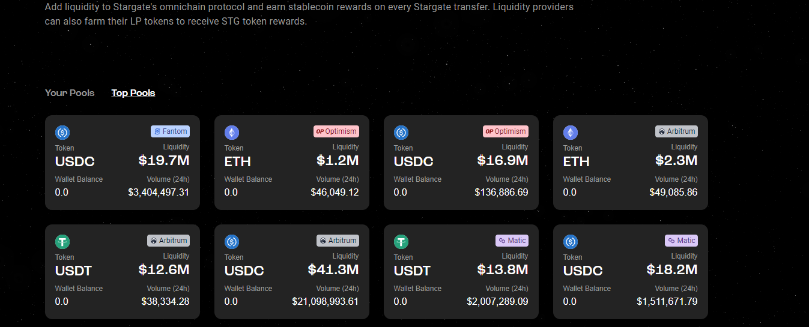
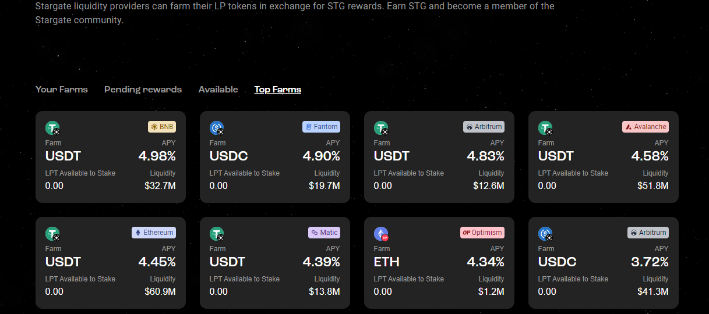
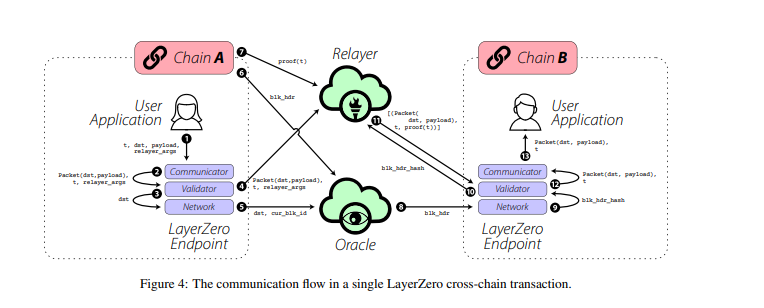

#### 1. Stargate是什么

Stargate 是建立在LayerZero 上面的一个互操作性的跨链应用。LayerZero 作为其底层的协议，获得了 [a16z](https://a16z.com/2022/03/30/investing-in-layerzero/),红杉，CoinBase, Binance Labs 等各大投资龙头的青睐。

目前在Stargate 上已经支持[Ethereum, BNB Chain, Avalanche,matic, Arb, OP, Fantom]， 这些EVM链直接的资产跨链， 但跨链资产也比较有限，现在也只有ETH, USDT, STG, USDC 这些风险较低的token 。


#### 2. Stargate上的添加流动性

在Stargate 上面可以为这些代币添加流动性，这样在每次用户跨链的时候，可以获得一笔跨链的交易手续费的收益。

不过目前来看，如果自己体量比较小的话，在这里做LP的收益并不是很高。




在各个池中提供流动性的LP 代币可以在Stargate 平台进行Farm，可能是因为都是比较稳定的资产，所以收益相对都不是很高。Farm所挖到的是平台所提供的[STG 代币](https://coinmarketcap.com/currencies/stargate-finance/) 。





#### 3. STG Token

STG 代币可以用来被质押，使用VE 模型，获取到veSTG, 用来参与DAO 的投票。 同时，也有另外一种Token， sveSTG，专门用于Stargate团队的投票权,参与拍卖和投资。


#### 4. LayerZero的愿景与实现

LayerZero 想要打造的是一种多链互通的操作协议，每条链上都提供一个端点(Endpoint)，这些端点都是使用一系列的合约来进行实现。

> A LayerZero Endpoint is split into four modules: Communicator, Validator, Network, and Libraries.


Oracle 是一款第三方的服务，独立于整个LayerZero的应用，预言机来提供从一条链读取区块头，从而发送到另外一条链的作用。

Relayer 中继层，也是一种链下应用，但Relayer 拉取 的是某个交易的proof，从而进行跨链信息的同步，而且Relayer 与Oracle 之间必须是一种独立的关系，两者互不干涉，互不影响，从而用户自己可以做可信的验证





#### 5.LayerZero 的具体步骤

具体执行的步骤在[白皮书](https://layerzero.network/pdf/LayerZero_Whitepaper_Release.pdf)里面已经表达的非常清晰，在[这篇文章](https://web3caff.com/zh/archives/32338)中也有一个非常明确的解释。

Oracle 和Relayer 是一个进行相互验证的过程，最坏情况，Oracle 提供的区块头和Relayer 提供的交易根都被篡改，可能会发生错误的跨链。但这种两者都出现问题的的几率非常非常小，而且使用Chainlink 提供的Oracle 本质上也可以得到安全的一层保障。


#### 6. 发送跨链消息的代码示例

在LayerZero的[Github](https://github.com/LayerZero-Labs/solidity-examples/blob/main/contracts/examples/OmniCounter.sol) 上面，提供了很多示例合约，我们可以直接测试这些例子。

比如一个比较简单的对其他了链发送对计数器+1 的消息。

```solidity
function incrementCounter(uint16 _dstChainId) public payable {
        _lzSend(_dstChainId, bytes(""), payable(msg.sender), address(0x0), bytes(""), msg.value);
    }
    
    
   function _lzSend(uint16 _dstChainId, bytes memory _payload, address payable _refundAddress, address _zroPaymentAddress, bytes memory _adapterParams, uint _nativeFee) internal virtual {
        bytes memory trustedRemote = trustedRemoteLookup[_dstChainId];
        require(trustedRemote.length != 0, "LzApp: destination chain is not a trusted source");
        lzEndpoint.send{value: _nativeFee}(_dstChainId, trustedRemote, _payload, _refundAddress, _zroPaymentAddress, _adapterParams);
    }
```


这里指定目标链的chainId， 这些endPoint 便会根据这些chainId，从而将消息通过endPoint 发送给Communicator, 之后将这些参数打包。发送到验证者节点，另外一条链监听着验证者节点的消息传输，到达另外一条链之后，通过oracle 和Relayer 来进行消息的验证，通过后另外一条链开始执行接受到的消息的逻辑。

最后可以实现从A 链发消息，B 链真实的将Counter+1 的操作。


#### 7. LayerZero 之后会发展的应用


目前Stargate 只是实现了一些链的资产跨链，之后会有更多的应用来使用layerZero 这套协议。比如跨链Swap，跨链的借贷 ，NFT 跨链 ，组合起来之后可以实现更多有趣，有用的玩法。同样LayerZero 会接更多的不同虚拟机的链，从而真正使得各条链直接完成真正的“互操作性”。