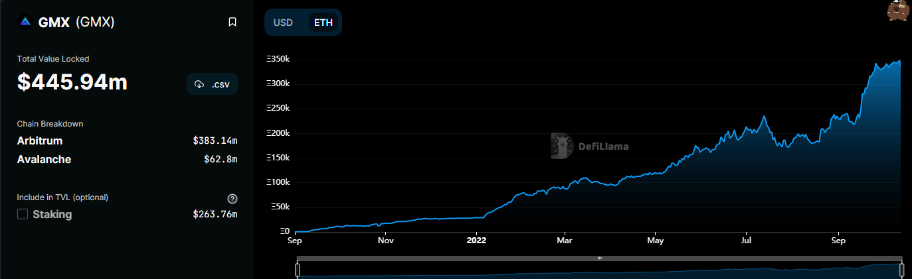
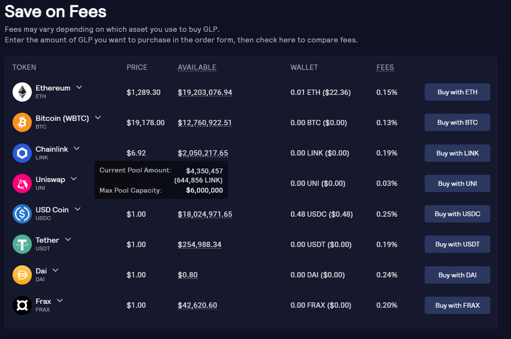
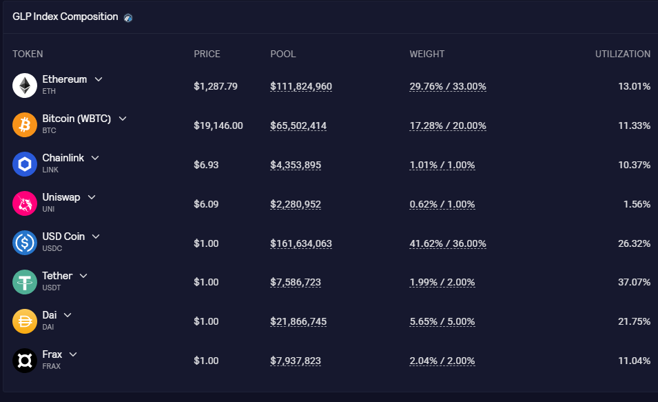
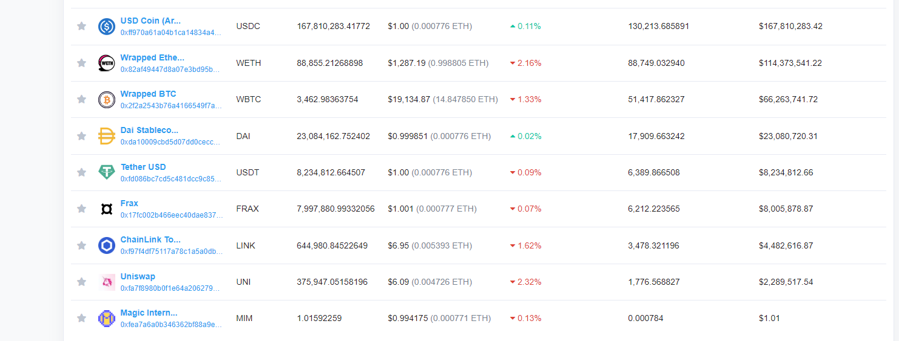

#### 1.什么是GMX

GMX是一个去中心化的现货和永续合约交易所，并且提供了无滑点的Sawp。GMX的实现使用了"双代币模型" GMX 是主要的治理代币，GLP 是GMX代表的LP代币,表示 LP 在流动性池里的份额。

最早知道GMX 的时候，是在Arbitrum 上面Odyssey 第二周交互的project list上，但当时太多人参与奥德赛，从而使得Arbitrum的负荷有些超载，从而不得不暂停奥德赛活动。

但熊市并没有影响GMX的增长，其TVL 在这几个月来不断的升高。




#### 2. GMX 代币


GMX 是整个GMX 平台的治理代币，持有GMX 便可以参与投票，更重要的是也可以通过GMX 获得更多的收益。


**Gmx 发行与供应**

GMX是之前最早发行在BSC 上的[Gambit 项目](https://xvix.finance/migrate)迁到Arbitrum上面来的，总的GMX totalSupply 是根据GMX 进行Vest的数量来决定的。预计总的GMX发行为 13.25millon 个。

> 6m 从之前的gmxbit 上将代币XVIX迁移过来。
>
> 2m 在Uniswap 上做市
>
> 2m 为esGMX进行Vest做储备金
>
> 1m 由FloorPrice Fund 基金会进行管理
>
> 1m 为marekting dev 合作伙伴储备
>
> 0.25m 为团队现行释放


**GMX进行质押**

将GMX进行质押会得到三部分的回报

*  esGMX ( 托管的GMX )

  可用于Vest ，从而获得更多的GMX 收益

* MP (Multiplier Points  )

  > 乘积点数，相当于基本收益的增强器

* native Token rewards (ETH/Avax)

  > 来源于从Swap 和杠杆交易的30%的手续费抽成，Swap成 nativeToken ，分发给质押者，


**esGMX**

将GMX 进行质押可以收到esGmx的奖励。

esGMX 本身是一本ERC20的代币合约，在transfer的时候加了限制

```solidity
if (inPrivateTransferMode) {
            require(isHandler[msg.sender], "BaseToken: msg.sender not whitelisted");
}
```

只有开私人转账模式 / 加入白名单，用户才能transfer esGMX， 平时分发奖励的**RewardDistributor** 合约一直都在白名单中


esGMX 有着两种用途

* 质押esGMX 获得GMX的代币收益

* vest ，将esGMX 启动Vest, 这些esGMX 将每秒转化为GMX ，并在365天后获所有的GMX。

  esGMX 是通过GMX进行质押获得到的，这些处于质押状态的GMX在这个过程也不能卖掉。 


#### GLP Token


GLP 是平台的一种LP 代币,是一种包含多资产在内的指数池中的LP Token 。

在GLP的体系中，在池中Swap是没有无偿损失的，GLP的价格是根据交易者的盈利 /损失来决定的。







在mint GLP的时候， 会根据整个池的资产数量来决定mint 所需的费用，如上图，整个池中的UNI数量距离还不到预定的比例 ，所以给mint 的费用较低，而USDC 就相对比较充足，所以就需更多的mint Fee。


**GLP 的收益**

GLP 无需再质押默认就是有收益的，GLP 的Holder 会获得esGMX的收益和剩下70%的交易手续费(兑换成native Token Rewards)，GLP Token 的全名是: Fee + Staked GLP。


**Vault合约**

通过mint GLP 的时候，会将用户手中的代币存进合约Valut (金库)合约中，合约内部是通过USDG稳定币 来进行流通的，先将对于代币根据预言机的报价兑换成对应数量的USDG ,之后将这些USDG从GLPManger 中购买预言机的价格购买GLP，usdg从而放到[GLPManager 合约](https://arbiscan.io/address/0x321F653eED006AD1C29D174e17d96351BDe22649)中， 之后mint 出对应量的GLP 出来转给用户。


整个项目池中代币数量[目前是这样的](https://arbiscan.io/tokenholdings?a=0x489ee077994b6658eafa855c308275ead8097c4a)。




**GLP价格计算**


otal worth of assets in index including profits and losses of open positions) / (GLP supply).


#### 永续合约交易


**交易规则**

* 开多/ 开空，最大开到30倍的杠杆。
* 开仓交易费用为仓位大小的0.1%，平仓时，同样要收0.1%的交易费。
* 


参考链接

https://twitter.com/floodcapital/status/1462901028706308101

https://gmx-io.notion.site/GMX-Technical-Overview-47fc5ed832e243afb9e97e8a4a036353

[GMX Research Report by Riley.pdf - Google Drive](https://drive.google.com/file/d/1xG-Qn2-9xqHQennB03BLdE2O5tXa5Vro/view)
